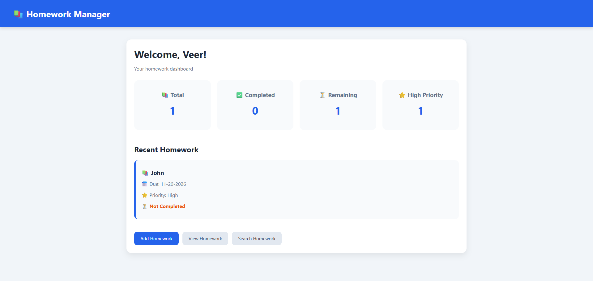
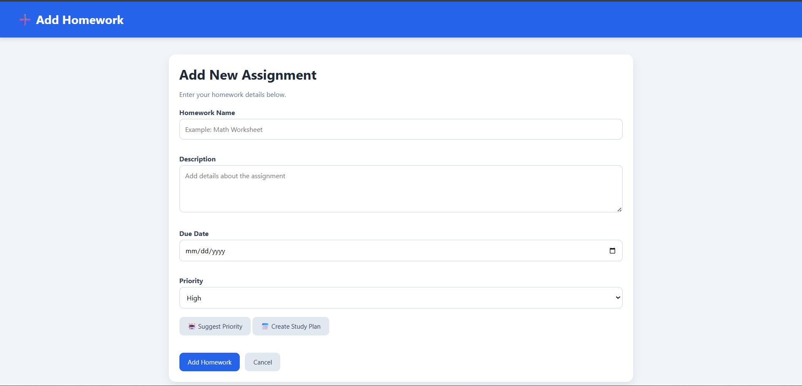
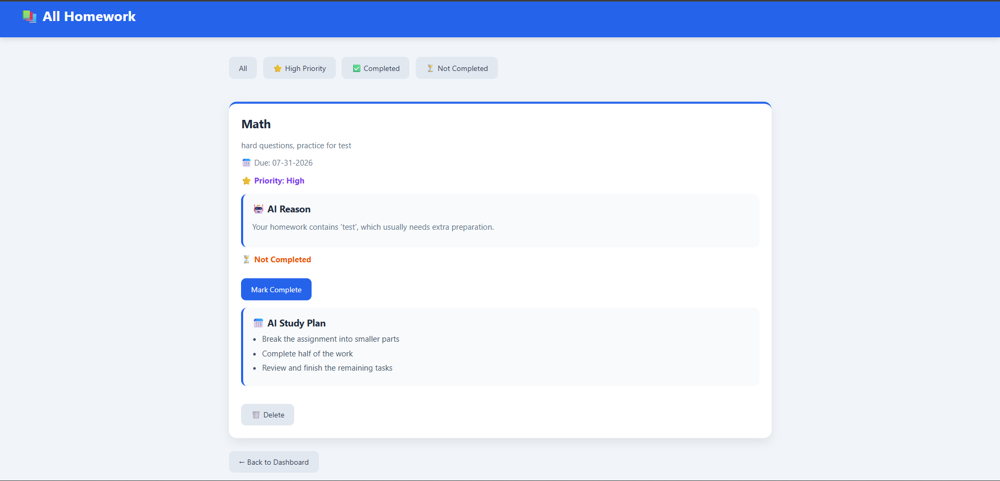

# 📚 Homework Manager AI

Homework Manager AI is a Flask-based web application designed to help students organize and manage their assignments. Users can add, search, filter, complete, and delete homework while tracking progress through a dashboard. The app includes AI-powered features that suggest homework priority levels with explanations and generate personalized study plans based on assignments and deadlines. Built using Python, Flask, HTML, CSS, JavaScript, and JSON storage, this project demonstrates full-stack development, data management, and AI integration.

## Features

- Add and manage homework assignments
- Track completed and incomplete tasks
- Search and filter homework
- Priority sorting and overdue detection
- Dashboard statistics
- AI priority recommendations
- AI explanations for priority choices
- AI-generated study plans

## Technologies

Python • Flask • HTML • CSS • JavaScript • JSON

## How to Run

Install Flask:

pip install flask

Run the application:

python app.py

Then open:

http://127.0.0.1:5000

## Future Improvements

- User accounts
- Database storage
- Calendar integration
- More advanced AI recommendations

## Screenshots

### Dashboard

### Add Homework

### Homework Management
